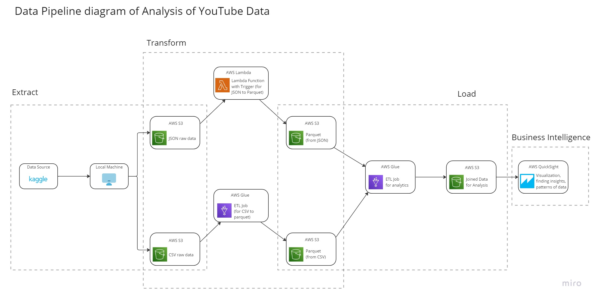

# AWS Data Engineering Project - YouTube Trending Data Analysis

This repository contains a data pipeline for analyzing YouTube trending videos and identifying the top-performing video categories across regions.

Dataset: [Kaggle YouTube Dataset](https://www.kaggle.com/datasets/datasnaek/youtube-new)

## Project Highlights

- End-to-end data ingestion pipeline
- Data cleansing and transformation using AWS Glue
- Data cataloging using AWS Glue Data Catalog
- ETL pipeline for structured analytics
- Event-driven processing using AWS Lambda triggers
- Data partitioning for query optimization
- Analytical queries using Amazon Athena
- BI visualization using Amazon QuickSight
- Scalable cloud-native architecture on AWS

## AWS Services Used

### Data Ingestion
- Amazon S3
- AWS CLI
- IAM

### Data Processing / Transformation
- AWS Lambda (event-driven triggers)
- AWS Glue (Crawlers, ETL Jobs, Data Catalog)
- Amazon S3
- IAM

### Data Querying / Analytics
- Amazon Athena
- AWS Glue Data Catalog
- Amazon S3
- IAM

### Business Intelligence
- Amazon QuickSight
- AWS Glue Data Catalog
- Amazon S3
- IAM

## File Formats Handled

- CSV
- JSON
- Parquet

## Other Tools

- Miro – Used for designing the data pipeline architecture

## References

- https://www.youtube.com/watch?v=yZKJFKu49Dk
- https://aws.amazon.com/
